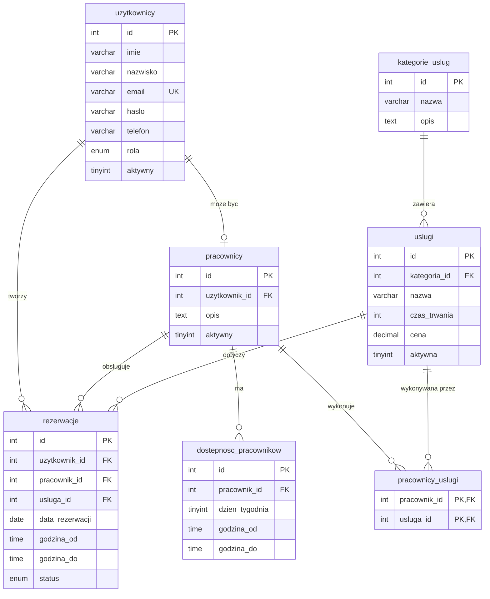

# Diagram ERD

```mermaid
erDiagram
    uzytkownicy ||--o| pracownicy : "moze byc"
    uzytkownicy ||--o{ rezerwacje : "tworzy"
    pracownicy ||--o{ rezerwacje : "obsluguje"
    pracownicy ||--o{ dostepnosc_pracownikow : "ma"
    pracownicy ||--o{ pracownicy_uslugi : "wykonuje"
    uslugi ||--o{ pracownicy_uslugi : "wykonywana przez"
    uslugi ||--o{ rezerwacje : "dotyczy"
    kategorie_uslug ||--o{ uslugi : "zawiera"

    uzytkownicy {
        int id PK
        varchar imie
        varchar nazwisko
        varchar email UK
        varchar haslo
        varchar telefon
        enum rola
        tinyint aktywny
    }

    pracownicy {
        int id PK
        int uzytkownik_id FK
        text opis
        tinyint aktywny
    }

    kategorie_uslug {
        int id PK
        varchar nazwa
        text opis
    }

    uslugi {
        int id PK
        int kategoria_id FK
        varchar nazwa
        int czas_trwania
        decimal cena
        tinyint aktywna
    }

    pracownicy_uslugi {
        int pracownik_id PK, FK
        int usluga_id PK, FK
    }

    dostepnosc_pracownikow {
        int id PK
        int pracownik_id FK
        tinyint dzien_tygodnia
        time godzina_od
        time godzina_do
    }

    rezerwacje {
        int id PK
        int uzytkownik_id FK
        int pracownik_id FK
        int usluga_id FK
        date data_rezerwacji
        time godzina_od
        time godzina_do
        enum status
    }
```
